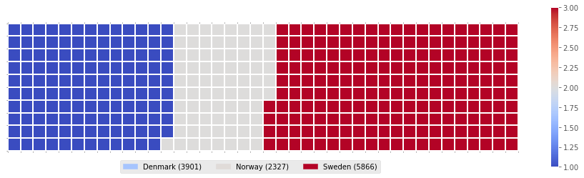

# WaffleChart
A Waffle chart is a great way to visualize data in relation to a whole or to highlight progress against a given threshold.

  

Unfortunately Matplotlib does not have a built-in function to create waffle charts. Therefore, I'll walk you through the
process of creating your own Python function to create waffle charts.
